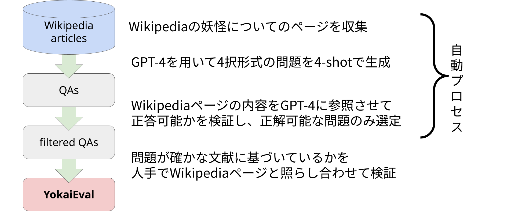
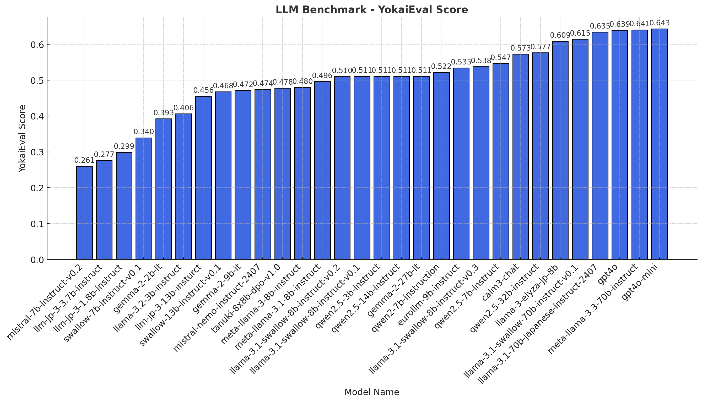
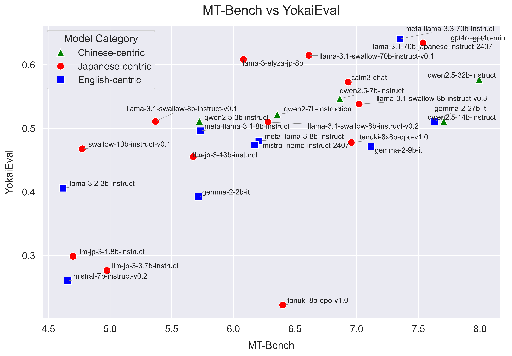

<div align="center">
<h1>YokaiEval: 妖怪知識評価データセット</h1>

<a href='https://huggingface.co/datasets/cyberagent/YokaiEval'></a>
<h6><a href='https://www.anlp.jp/proceedings/annual_meeting/2025/pdf_dir/Q2-23.pdf'>NLP2025</a></h6>
</div>

<div align="center">
    <a href="#features">Features</a>・
    <a href="#install">Install</a>・
    <a href="#usage">Usage</a>・
    <a href="#results-of-yokaieval">Results</a>
</div>

[[English](./README.md) | Japanese]

このリポジトリは、YokaiEvalの構築・実行のためのコードが含まれています。
構築されたデータセットはHuggingFaceで公開されています。データセットの詳細についてはこちらを確認してください [Dataset](https://huggingface.co/datasets/cyberagent/YokaiEval)

同様の手法で妖怪以外のドメインに関するデータセットを自動構築可能です。




## Features
- YokaiEvalによるLLMの評価ベンチマークを実行できます
- 特定ドメインに関する4択形式の問題と選択肢を自動生成できます
- 生成されたデータで複数のLLMに回答を生成させることができます
- 回答結果を GPT-4o で評価し、ベンチマークを実行可能です

## Install

### Requirements
- Python==3.10

LLMの推論には GPU 環境も必要です。

### Install dependences
このプロジェクトではパッケージマネージャに[uv](https://docs.astral.sh/uv/getting-started/installation/) を使用しています。

uv のインストール
```bash
pip install uv
```

依存ライブラリインストール
```bash
uv sync --frozen
```

### 環境変数の設定
`.env.example`の内容に沿って`.env`ファイルをプロジェクトルートに作成してください。

## Usage

### YokaiEvalでモデルを評価する

#### LLMに回答させる
モデルの推論にはモデルごとにflash-attn等が別途必要です。

評価を実行する対象のモデルは [main.py](./main.py) にハードコーディングされています。
```bash
python3 main.py eval --verify_questions works/YokaiEval.json --output_dir responses
```

#### 回答をjudgeする
GPT-4 を評価モデルとして回答をjudgeします。`--answers_dir`で指定したディレクトリ内のすべての出力に対して評価が実行されることに注意してください。
```bash
python3 main.py rejudge --mode gpt --answers_dir responses --output_dir results
```

#### スコアを計算
```bash
python3 main.py visualize --answers_dir results --output works/scores
```

### 特定のドメインでオリジナルのデータセットを構築する
YokaiEvalと同様の手法で特定ドメインについての4択問題QAデータセットを構築することができます。

#### データセット作成に参照する情報源を作成する
何らかの情報源から[data/yokai_list.json](data/yokai_list.json)のようなファイルを作成します。

[src/get_yokai_info.py](./src/get_yokai_info.py)を参考に各自で利用したい情報源に合わせてスクリプトを組んでください。

#### 問題と選択肢を4-shotで生成する
[prompts/prompt_template.txt](prompts/prompt_template.txt) は妖怪用のプロンプトになっているので、妖怪以外について生成したい場合は適宜修正してください。
```bash
python3 main.py generate --num 20 --yokai_list data/yokai_list.json --output data/verify_questions.json
```

#### 生成された問題を検証しフィルタリングする
```bash
python3 main.py check_verify --verify_questions data/verify_questions.json
```

```bash
python3 main.py filter_verify --verify_questions data/verify_questions.json --output data/gpt4o-mini-check-question-is-verify.json
```

## Reference
```
@InProceedings{yokai2025,
  author = 	"堤歩斗 and 陣内佑",
  title = 	"LLM は日本の民話を知っているか？ 妖怪知識評価データセットの構築へ向けて",
  booktitle = 	"言語処理学会第31回年次大会",
  year =	"2025",
  note= "in Japanese"
  url="https://www.anlp.jp/proceedings/annual_meeting/2025/pdf_dir/Q2-23.pdf"
}
```

## Results of YokaiEval



