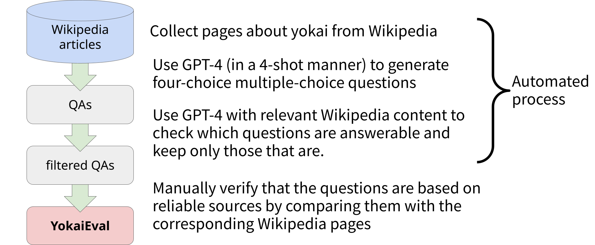
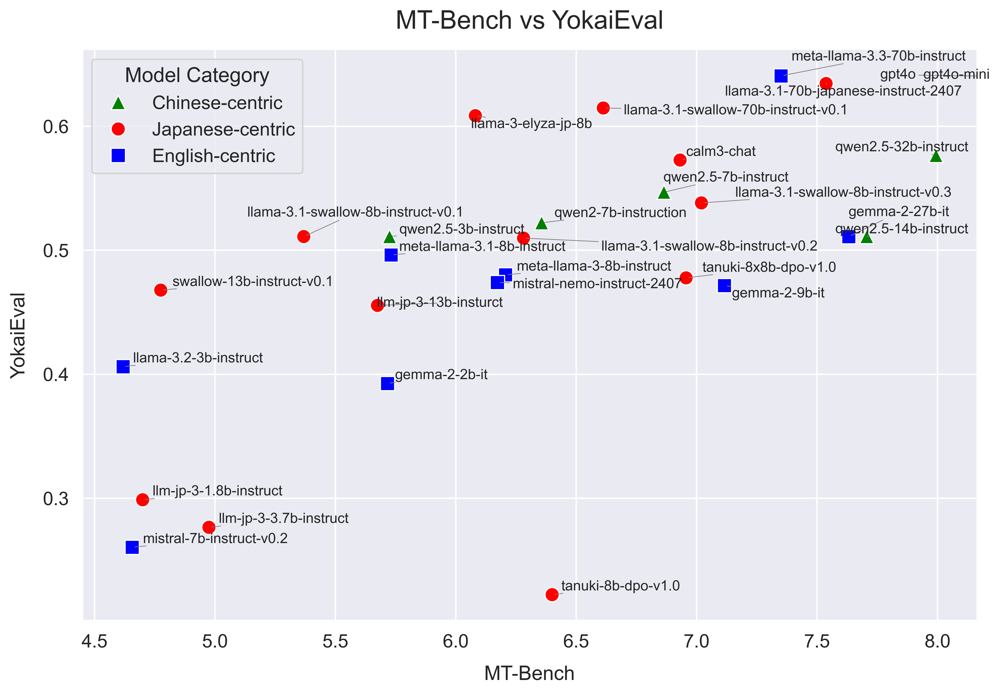

<div align="center">
<h1>YokaiEval: Yokai Knowledge Evaluation Dataset.</h1>

<a href='https://huggingface.co/datasets/cyberagent/YokaiEval'></a>
<h6><a href='https://www.anlp.jp/proceedings/annual_meeting/2025/pdf_dir/Q2-23.pdf'>NLP2025</a></h6>
</div>

<div align="center">
    <a href="#features">Features</a>・
    <a href="#install">Install</a>・
    <a href="#usage">Usage</a>・
    <a href="#results-of-yokaieval">Results</a>
</div>

[English | [Japanese](README-ja.md)]

This repository contains code for constructing and running YokaiEval.
The constructed dataset is available on Hugging Face. For details on the dataset, please see: [Dataset](https://huggingface.co/datasets/cyberagent/YokaiEval)

Using a similar approach, you can automatically build datasets for domains other than yokai.



## Features
- You can run an LLM evaluation benchmark using YokaiEval.
- Automatically generate multiple-choice (4-option) questions and choices on a specific domain.
- Generate answers for multiple LLMs with the generated data.
- Evaluate the answers with GPT-4o and run a benchmark.

## Install

### Requirements
- Python==3.10

Inference of LLMs also requires a GPU environment.

### Install dependencies
This project uses [uv](https://docs.astral.sh/uv/getting-started/installation/) as its package manager..
```bash
pip install uv
```
Install dependencies:
```bash
uv sync --frozen
```

### Setting up environment variables
Create a `.env` file in the project root according to the contents of `.env.example`.

## Usage

### Evaluate models with YokaiEval

#### Have the LLM generate answers
Depending on the model, you may need flash-attn or other requirements for inference.

In [main.py](./main.py), the models targeted for evaluation are hard-coded.
```bash
python3 main.py eval --verify_questions works/YokaiEval.json --output_dir responses
```

#### Judge the answers
Use GPT-4 as the evaluation model to judge the answers. Please note that the evaluation will be performed on all outputs within the directory specified by `--answers_dir`.
```bash
python3 main.py rejudge --mode gpt --answers_dir responses --output_dir results
```

#### Calculate scores
```bash
python3 main.py visualize --answers_dir results --output works/scores
```

### Build an original dataset for a specific domain
You can build a multiple-choice (4-option) question dataset using the same approach as YokaiEval for any particular domain.

#### Prepare a source of information to reference when creating the dataset
Create a file similar to [data/yokai_list.json](data/yokai_list.json) from some information source.
Please create a script tailored to your desired information source, referring to [src/get_yokai_info.py](./src/get_yokai_info.py) as an example.

#### Generate questions and choices using a 4-shot prompt
[prompts/prompt_template.txt](prompts/prompt_template.txt) is a prompt designed for yokai. If you want to generate questions for other domains, please modify it as needed.
```bash
python3 main.py generate --num 20 --yokai_list data/yokai_list.json --output data/verify_questions.json
```

#### Validate and filter the generated questions
```bash
python3 main.py check_verify --verify_questions data/verify_questions.json
```

```bash
python3 main.py filter_verify --verify_questions data/verify_questions.json --output data/gpt4o-mini-check-question-is-verify.json
```

## Results of YokaiEval




## Reference
```
@InProceedings{yokai2025,
  author = 	"堤歩斗 and 陣内佑",
  title = 	"LLM は日本の民話を知っているか？ 妖怪知識評価データセットの構築へ向けて",
  booktitle = 	"言語処理学会第31回年次大会",
  year =	"2025",
  note= "in Japanese"
  url="https://www.anlp.jp/proceedings/annual_meeting/2025/pdf_dir/Q2-23.pdf"
}
```
